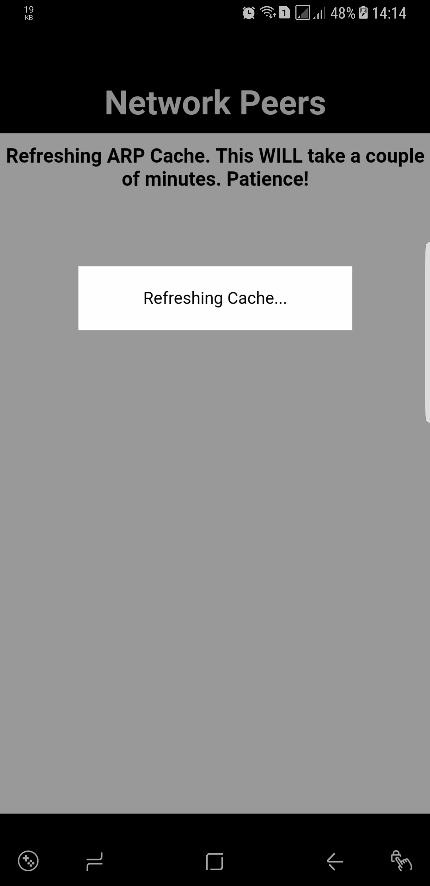
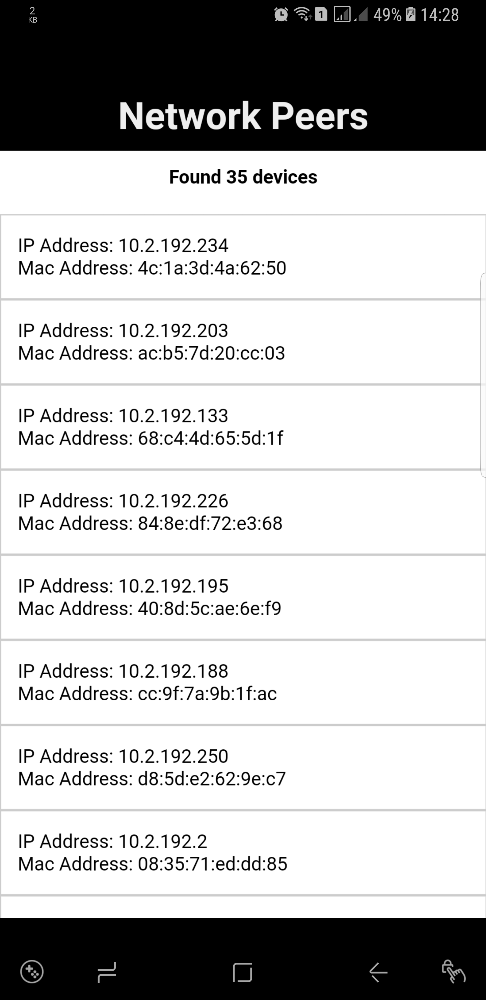

Example implementation of Android ARP Cache
======
## Plugin
[cordova-android-arp-cache](https://github.com/arvindr21/cordova-android-arp-cache): Get Android ARP Cache or Query ARP Cache against an IP Address or a MAC Address.


## Setup

```bash
$ cordova create NetworkPeers
$ cd NetworkPeers
$ cordova platform add android --save
$ cordova plugin add cordova-arp-cache-fetch --save
```

## Code

```js
// www/js/index.js
var refreshCacheBeforeFetch = true;
var app = {
    // Application Constructor
    initialize: function() {
        document.addEventListener('deviceready', this.onDeviceReady.bind(this), false);
    },

    // deviceready Event Handler
    //
    // Bind any cordova events here. Common events are:
    // 'pause', 'resume', etc.
    onDeviceReady: function() {
        app.receivedEvent('deviceready');
    },

    // Update DOM on a Received Event - No such thing will happen :D
    receivedEvent: function(id) {
        app.runPlugin();
    },

    runPlugin: function() {
        if (refreshCacheBeforeFetch) {
            utils.updateElemById('messages', '<h3>Refreshing ARP Cache. This WILL take a couple of minutes. Patience!</h3>');
            utils.showLoading('Refreshing Cache...');
            ARP.refreshCache(function(resp) {
                console.log('Refresh Complete', resp);
                utils.hideLoading();
                app.fetchPeers();
            }, function(error) {
                utils.updateElemById('errors', error);
                utils.hideLoading();
            });
        } else {
            app.fetchPeers();
        }
    },

    fetchPeers: function() {
        utils.showLoading('Fetching Peers...');
        ARP.getParsedCache(function(resp) {
            console.log('Devices', resp);
            var html = '<h4 class="text-center">Found ' + resp.length + ' devices</h4>';
            html += '<ul>';
            for (var i = 0; i < resp.length; i++) {
                var d = resp[i];
                html += '<li>';
                html += '<p>'
                html += '<label>IP Address: ' + d.ip + ' <label>'
                html += '<br>'
                html += '<label>Mac Address: ' + d.mac + ' <label>'
                html += '</p>'
                html += '</li>';
            }
            html += '</ul>';
            utils.updateElemById('devices', html);
            utils.hideLoading();
            utils.updateElemById('messages', '');
        }, function(error) {
            utils.updateElemById('errors', error);
            utils.hideLoading();
        });
    }
};

var utils = {
    updateElemById: function(elem, html) {
        document.getElementById(elem).innerHTML = html;
    },
    showLoading: function(text) {
        text = text || 'Processing...';
        var loaderText = document.getElementById('loaderText');
        loaderText.innerText = text;
        var modal = document.getElementById('loader');
        modal.style.display = "block";
    },
    hideLoading: function() {
        var modal = document.getElementById('loader');
        modal.style.display = "none";
    }
}

app.initialize();
```

## Run

```bash
$ cordova run android
```

## Output

Refreshing Cache            |  List of Peers
:-------------------------:|:-------------------------:
  | 